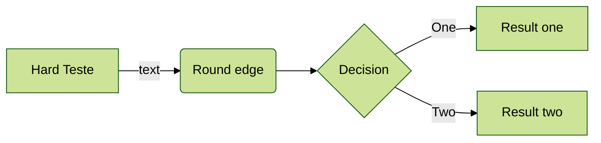

# Formato do tipo    

This is a paragraph.

Both [internal](index.md) and [external](https://encrypted-tbn0.gstatic.com/images?q=tbn:ANd9GcSf_W1AbzTnD0a2tdaFSNne16Uxbl5lWjL2XVlIGSi6_YEuacUwvxEi9atOF9aJYGF-Jzo&usqp=CAU) links work. [!file](index.md)

[!button corners="pill" text="Clique aqui" variant="info" icon="person"](introducao.md)

Another paragraph with **bold**, _italic_, ~~strikethrough~~, and `code` samples.

